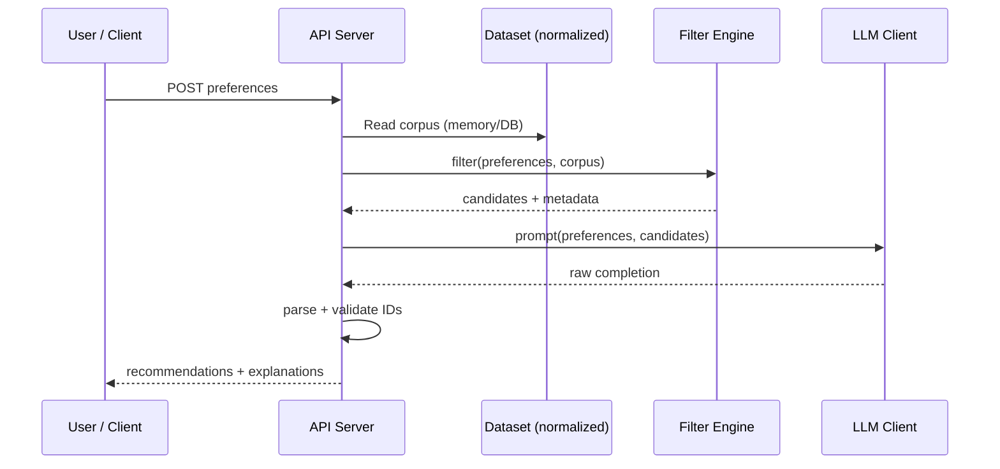

# Phase-Wise Architecture: AI-Powered Restaurant Recommendation System

This document expands the high-level workflow from the [problem statement](./problem%20statement.md) into a buildable, phase-by-phase architecture: components, interfaces, data contracts, and quality gates.

**Reference dataset:** [ManikaSaini/zomato-restaurant-recommendation](https://huggingface.co/datasets/ManikaSaini/zomato-restaurant-recommendation) (Hugging Face).

---

## Cross-cutting concerns (all phases)

| Concern | Guidance |
|--------|----------|
| **Configuration** | Externalize paths, model name, API keys, max candidates to LLM, and dataset revision or snapshot ID. Phase 3 Groq settings (model id, base URL if needed) live with app config. |
| **Secrets** | Never commit API keys. Phase 3 **Groq** API key is loaded from a **`.env`** file at the project root (not committed); the running process reads it as environment variables (e.g. via `python-dotenv` or the HTTP framework’s env loader). Keep `.env` in `.gitignore`. |
| **Logging** | Structured logs (JSON or key=value): phase timings, filter counts, LLM latency, errors without leaking full prompts in production if sensitive. |
| **Testing** | Unit tests for filters and prompt serialization; integration tests with a mocked LLM; a small fixed subset of rows for regression. |
| **Versioning** | Pin dataset revision; document schema mapping version alongside code. |

---

## Phase 1 — Data foundation and ingestion

### 1.1 Goals

- Reliably load the Zomato-style dataset from Hugging Face.
- Normalize fields into an internal **canonical restaurant record** used by all downstream phases.
- Support repeatable runs (same snapshot → same filtered sets for the same inputs).

### 1.2 Canonical data model (conceptual)

Define a single internal type (language-agnostic fields):

| Field | Type | Notes |
|-------|------|--------|
| `id` | string | Stable surrogate if source has no ID (hash of name+location+cuisine). |
| `name` | string | Trimmed, consistent casing policy (e.g. title case for display). |
| `location` / `city` | string | Aligned with user input vocabulary (synonyms map if needed, e.g. “Bengaluru” ↔ “Bangalore”). |
| `cuisines` | list[string] | Split on delimiters if source stores comma-separated; dedupe; lowercase for matching. |
| `rating` | float or null | Aggregate rating; define behavior when null (exclude vs default bucket). |
| `cost_for_two` or `cost_tier` | number and/or enum | Map raw column(s) to `low` / `medium` / `high` using configurable thresholds. |
| `raw_row` or `source_fields` | optional map | Preserve extra columns for future features or LLM context (e.g. votes, establishment type). |

### 1.3 Components

| Component | Responsibility |
|-----------|----------------|
| **Dataset loader** | Uses `datasets` library (or equivalent) to load `ManikaSaini/zomato-restaurant-recommendation`; supports `revision` or local cache path. |
| **Column mapper** | Maps Hugging Face column names → canonical model; fails fast or logs if unexpected schema. |
| **Normalizers** | Text normalization (Unicode, whitespace), cuisine splitting, city alias table, rating parsing. |
| **Budget classifier** | If only numeric “cost for two” exists, apply thresholds (configurable per currency/region). |
| **Persistence (optional)** | Write normalized table to Parquet/SQLite for faster cold start; optional `DATASET_CACHE_DIR`. |

### 1.4 Interfaces

- **`load_dataset(config) -> Iterator[RestaurantRecord]`** or **`-> DataFrame`**: returns normalized records.
- **`get_schema_version() -> str`**: for debugging and compatibility checks.

### 1.5 Non-functional requirements

- **Cold start:** First download may be slow; document expected size and optional pre-download step.
- **Memory:** For large splits, consider streaming, chunking, or DB indexing instead of holding full frame in RAM if needed later.

### 1.6 Exit criteria (Phase 1)

- [x] Dataset loads without manual steps beyond documented env/setup (`DatasetConfig`, `load_dataset`, `README.md`).
- [x] At least N sample rows (e.g. 1000) pass validation — run `python3 -m recommender.validate --min-valid 1000` after first Hub download (`has_required_fields()` = normalized `name` + `city`).
- [x] Documented mapping from raw columns → canonical fields (`recommender.schema.RAW_COLUMN_MAP`, `README.md` table).

---

## Phase 2 — Preference model and deterministic filtering

### 2.1 Goals

- Turn user preferences into a **bounded candidate list** that is always grounded in the dataset.
- Apply filters in a predictable order with explicit **relaxation** when the result set is too small.

### 2.2 User preference contract (API / UI input)

Structured payload (example shape):

```json
{
  "location": "Delhi",
  "budget_for_two_inr": 1200,
  "cuisines": ["Italian"],
  "min_rating": 4.0,
  "extras": "family-friendly, quick service"
}
```

| Field | Validation |
|-------|------------|
| `location` | Optional / null = all areas; user-facing **locality** string (often a neighborhood). Normalize with Phase 1; filter matches substring on **neighborhood**, **city**, or **address** (`_location_matches`). |
| `budget_for_two_inr` | Required positive integer: maximum approximate **cost for two (INR)**. Filtering keeps rows with known `cost_for_two <= budget_for_two_inr` (unknown cost excluded under strict budget). |
| `cuisines` | List of strings; **empty list = any cuisine** (optional constraint). |
| `min_rating` | Float in [0, 5] or domain-appropriate range; clamp or reject out of range. |
| `extras` | Free text; used in Phase 3 for LLM reasoning, not for hard filtering unless you add keyword rules later. |

Alias: **`budget_max_inr`** is accepted by `UserPreferences.from_mapping` as a synonym for `budget_for_two_inr` (non-HTTP paths).

### 2.3 Filter pipeline (recommended order)

1. **Location filter** — exact or fuzzy match on city/location field.
2. **Cuisine filter** — any-of match on normalized cuisine tokens (substring or token overlap).
3. **Budget filter** — numeric ceiling: `cost_for_two <= budget_for_two_inr` (requires known `cost_for_two`; see relaxation).
4. **Minimum rating** — `rating >= min_rating`; decide policy for null ratings (typically exclude).
5. **Cap** — take top M by rating/reviews (if review count exists) or random sample for diversity, then **hard cap** (e.g. 15–30) rows for LLM context limits.

### 2.4 Relaxation strategy (when count &lt; K_min)

Define `K_min` (e.g. 5) and `K_target` (e.g. 20). If after strict filters count &lt; `K_min`, relax in order (configurable):

1. Widen location (e.g. same state / metro synonyms) — optional if you have geo metadata.
2. Drop secondary cuisines, keep primary only.
3. Lower `min_rating` in small steps (e.g. 4.0 → 3.5) with a **maximum relaxation** floor.
4. **Widen budget cap** — increase `budget_for_two_inr` by **`budget_relax_step_inr`** (config, default 400 INR) per relaxation step, up to **`budget_relax_ceiling_inr`** (default 250000). Observable as `increased_budget_cap_inr` in `relaxations_applied`.

Each relaxation step should be **observable** in the API response (e.g. `applied_relaxations: []`) for transparency.

### 2.5 Components

| Component | Responsibility |
|-----------|----------------|
| **Preference validator** | Parses and validates JSON; returns typed `UserPreferences`. |
| **Filter engine** | Composable filters; produces `(candidates, metadata)`. |
| **Ranker (pre-LLM)** | Deterministic sort for tie-breaking and for fallback when LLM is unavailable (e.g. by rating, then name). |
| **Candidate packer** | Serializes capped list to the structure expected by Phase 3 prompt builder. |

### 2.6 Interfaces

- **`filter(preferences: UserPreferences, corpus: Iterable[RestaurantRecord]) -> FilterResult`**
  - `FilterResult` contains: `candidates: list[RestaurantRecord]`, `total_after_location`, `relaxations_applied`, `truncated: bool`.

### 2.7 Exit criteria (Phase 2)

- [x] For a fixed small fixture corpus, unit tests assert correct counts and ordering for representative preference combinations (`tests/test_phase2_filter.py`).
- [x] No LLM required to return a sensible top list (`filter_restaurants` + deterministic `_rank_pre_llm`).
- [x] Candidate count never exceeds configured max sent to Phase 3 (`FilterConfig.max_candidates`).

---

## Phase 3 — LLM integration layer (recommendation brain)

### 3.0 Provider: Groq

- **LLM backend:** [Groq](https://groq.com/) (OpenAI-compatible HTTP API) for chat completions in Phase 3.
- **Credentials:** Store the Groq API key in **`.env`** in the repository root, e.g. `GROQ_API_KEY=...` (exact variable name should match the Groq client/SDK used). Do not commit `.env`; document required keys in `README` or `.env.example` (placeholder values only).
- **Runtime:** Application code loads `.env` into the process environment before constructing the LLM client (or relies on the deployment platform to inject the same variables without a file).

### 3.1 Goals

- Use the LLM to **rank** and **explain** choices using **only** the candidate list provided (anti-hallucination).
- Produce **machine-parseable** output for the UI while keeping copy natural for users.

### 3.2 Prompt design (conceptual structure)

**System message (roles and rules):**

- You are a restaurant recommendation assistant for India (or dataset region).
- You will receive a JSON array of restaurants; you must **only** recommend from that list.
- If nothing fits well, say so and still pick the **best available** from the list (product policy).
- Output must follow the required schema (JSON or strict markdown blocks — pick one and enforce in parser).

**User message content (prompt `v2`):**

- User preferences JSON includes **`locality_or_area`**, **`max_budget_inr_for_two`**, **`cuisine_preferences`** (string describing selected tags or “any cuisine”), **`min_rating`**, **`extras`**.
- Candidate restaurants: compact fields per row (`id`, `name`, `cuisines`, `rating`, `cost`, `location`).
- System text states that empty/unspecified cuisines means any cuisine and that reasoning should respect the INR budget cap.

**Optional chain-of-thought:** Keep internal reasoning out of user-facing text if using APIs that expose reasoning; or use a two-step call (rank internally, then format) — trade latency vs quality.

### 3.3 Components

| Component | Responsibility |
|-----------|----------------|
| **Prompt template** | Versioned template (e.g. `v1`, `v2`); inject candidates and preferences safely (escape if embedding in formats that confuse the model). |
| **LLM client** | Groq-backed client (OpenAI-compatible messages API); thin wrapper so tests can mock `complete(messages, params) -> raw_text`. |
| **Response parser** | Parse to `list[{ rank, restaurant_id, explanation }]`, validate IDs against candidate set. |
| **Reconciliation** | If LLM returns unknown ID or duplicate, remap by fuzzy name match within candidates or drop invalid entries and backfill from deterministic rank. |
| **Fallback** | On timeout/parse failure: return top-K from Phase 2 with template explanation (“High rating and matches your cuisine”). |

### 3.4 Model and token parameters

- **Model:** A Groq-hosted model id (configurable via env or config file; choose defaults appropriate for latency vs quality).
- **Max output tokens:** Sized for K explanations (e.g. K=5, ~150 tokens each + overhead).
- **Temperature:** Lower (e.g. 0.3–0.7) for more stable rankings; document choice.
- **Retries:** Bounded retries on rate limit; no infinite loops.

### 3.5 Interfaces

- **`recommend(preferences, candidates: list[RestaurantRecord]) -> RecommendationResult`**
  - `RecommendationResult`: ordered `items: list[{ restaurant, explanation, rank }]`, optional `summary: string`, `model_id`, `prompt_version`, `fallback_used: bool`.

### 3.6 Safety and quality

- **Grounding:** Post-validate every returned `restaurant_id` ∈ candidate IDs.
- **PII:** Dataset is public restaurant data; still avoid echoing unsafe user content in logs verbatim if `extras` is sensitive.

### 3.7 Exit criteria (Phase 3)

- [x] Golden tests: mock LLM returns fixed JSON; parser and reconciliation covered (`tests/test_phase3.py`).
- [x] Live smoke test (optional): `pytest` test `test_recommend_live_groq_smoke` runs when `GROQ_API_KEY` is set (skipped otherwise).
- [x] 100% of served restaurants in responses exist in the filtered candidate set (`recommender.phase3.engine.recommend` grounding check + reconcile/backfill from candidates only).

---

## Phase 4 — Application shell, API, and presentation

### 4.1 Goals

- Expose an HTTP API (and optionally a minimal UI) that orchestrates Phases 1→2→3.
- Present **name, cuisine, rating, estimated cost, AI explanation** per the problem statement.

### 4.2 Backend architecture

| Piece | Detail |
|-------|--------|
| **Framework** | **FastAPI** (`src/recommender/phase4/`): `create_app()`, Uvicorn entry `recommender-api` / `python -m recommender.phase4.main`. |
| **Lifecycle** | On startup, materialize the normalized corpus via `DatasetConfig.from_env()` + `materialize_restaurants()` unless tests inject a fixed `corpus` tuple. |
| **Endpoints** | **`GET /`** — browser UI: **locality** `<select>` from **`GET /api/v1/localities`** (distinct `neighborhood` from loaded rows), **numeric INR budget**, optional cuisines → `POST /api/v1/recommend` (still uses JSON field **`location`** for the chosen locality string). `GET /health` — `{ status, corpus_size }`. **`POST /api/v1/recommend`** — body includes **`budget_for_two_inr`** and optional **`top_k`** (1–**12**): how many ranked recommendations to return; omit it to use **`RECOMMENDER_TOP_K`** / `GroqLLMConfig.top_k` (default **10** in code, max **12**). Disable UI with `create_app(..., serve_ui=False)`. |
| **Errors** | **400** — preference validation (`PreferenceValidationError` surfaced as `detail` string). **500** — unexpected server errors. LLM failures use Phase 3 deterministic fallback and **200** with `fallback_used: true` (503 reserved if product later opts to fail closed without fallback). |
| **OpenAPI** | Served at `/docs` (Swagger UI) and `/openapi.json` by FastAPI. |

### 4.3 Frontend (website)

Two surfaces share the same FastAPI contract:

| Surface | Path | Notes |
|--------|------|--------|
| **Embedded MVP** | FastAPI **`GET /`** | `src/recommender/phase4/web/index.html` — vanilla HTML; same origin as API. |
| **Next.js app (enhanced)** | **`frontend/`** | **Next.js 14** + **Tailwind**; layout inspired by **`Design/Zomato_ai_frontend_page_reference.png`** (hero with reference art, **CraveAI**-style header/footer, sidebar: locality select, budget **range**, cuisine **pills**, rating **range**, extras; results: loading state, cards with gradient image placeholder, **AI insight** panel). Calls API via **`NEXT_PUBLIC_API_BASE_URL`** (default `http://127.0.0.1:8000`). Reference PNG is copied into **`frontend/public/design-reference.png`** for the hero. Run: `cd frontend && npm install && npm run dev` → **http://localhost:3000**. |

| Piece | Detail |
|-------|--------|
| **Forms** | **Locality** **dropdown** (distinct `neighborhood` + “Any locality”), **max budget (₹ for two)** (number in MVP; **slider** in Next.js), **optional** cuisines (pills / comma list; blank = any), minimum rating, optional extras textarea, **number of recommendations** (`top_k`, up to 12; UI default 10). |
| **Results** | Card per restaurant: title + rank, area/city, rating and cost line, cuisine chips, explanation paragraph; summary and metadata strip (`fallback_used`, relaxations, filter funnel counts). |
| **UX** | Loading state on submit, inline error banner for 4xx/5xx/network, empty-state copy when no rows returned; optional info when candidates were truncated. |
| **Integration** | **Embedded UI:** same origin — no CORS. **Next.js (port 3000):** set **`RECOMMENDER_CORS_ORIGINS`** to include `http://localhost:3000` and `http://127.0.0.1:3000` on the API. |

### 4.4 Static assets and configuration

- **CORS** — `CORSMiddleware` when `enable_cors=True` (default); origins from **`RECOMMENDER_CORS_ORIGINS`**.
- **Env** — Phase 3: `GROQ_API_KEY`, `GROQ_MODEL`, **`RECOMMENDER_TOP_K`** (default ranked count when the request omits `top_k`), etc. Phase 1 dataset: `RECOMMENDER_DATASET_*`, `RECOMMENDER_MAX_ROWS`. Phase 2 budget relaxation: **`RECOMMENDER_BUDGET_RELAX_STEP_INR`**, **`RECOMMENDER_BUDGET_RELAX_CEILING_INR`**. Phase 4 / filter caps: **`RECOMMENDER_MAX_CANDIDATES`**, **`RECOMMENDER_FILTER_K_MIN`**, **`RECOMMENDER_FILTER_K_TARGET`**, **`RECOMMENDER_MIN_RATING_FLOOR`**, **`RECOMMENDER_RATING_RELAX_STEP`**. Server: **`RECOMMENDER_API_HOST`**, **`RECOMMENDER_API_PORT`**, **`RECOMMENDER_API_RELOAD`**.

### 4.5 Exit criteria (Phase 4)

- [x] Backend: `POST /api/v1/recommend` orchestrates filter + LLM + fallback; OpenAPI at `/docs`.
- [x] Basic validation errors return **400** with readable `detail`.
- [x] **Frontend (MVP)** — FastAPI `GET /` form → recommendations with required presentation fields (§4.3).
- [x] **Next.js frontend** — `frontend/` SPA (reference-driven layout) calling the same API with documented CORS for dev (§4.3).
- [x] End-to-end demo in browser against the running API (ensure `.env` / `GROQ_API_KEY` for LLM path, or expect deterministic fallback).

---

## Deployment

Production splits the stack across two hosts: the **Python recommender backend** on **Streamlit**, and the **Next.js web app** on **Vercel**. Local development may still use FastAPI plus `npm run dev` (Phase 4); the table below is the **target** hosted topology.

| Layer | Platform | What ships | Notes |
|-------|----------|------------|--------|
| **Backend** | [Streamlit Community Cloud](https://streamlit.io/cloud) (or self-hosted Streamlit Server) | Streamlit app entry point that loads the corpus, runs the filter + Phase 3 pipeline, and presents results (and any API bridge the implementation adds) | Pin Python version and dependencies (`requirements.txt` / `pyproject.toml`) to match CI. Configure **Streamlit Secrets** for `GROQ_API_KEY`, dataset env vars (`RECOMMENDER_DATASET_*`, etc.), and any caps from Phase 4.4 — do not commit secrets. Cold starts and resource limits follow Streamlit’s hosting tier; document expected first-request latency. |
| **Frontend** | [Vercel](https://vercel.com) | **`frontend/`** Next.js app: `npm run build` output as the Vercel project root | Set **`NEXT_PUBLIC_API_BASE_URL`** in Vercel **Environment Variables** to the **public base URL** of the backend the browser must call (include scheme, no trailing slash unless your client code expects it). Use separate values for **Preview** vs **Production** if backends differ. |

**Cross-origin (browser):** The Next.js origin (e.g. `https://<project>.vercel.app` and preview URLs) must be allowed by the backend’s CORS policy if the frontend calls an HTTP API on a different host. If the deployed backend is only a Streamlit page without a separate REST origin, align product and implementation (e.g. embed or proxy) so the Vercel app and Streamlit deployment stay consistent with the Phase 4 contract where needed.

**Operational checklist (summary):** Backend — secrets in Streamlit UI, dataset revision pinned, logging as in cross-cutting concerns. Frontend — `NEXT_PUBLIC_API_BASE_URL`, Vercel Node version aligned with `frontend/package.json` engines if specified, and smoke-test `POST /api/v1/recommend` from the deployed site.

---

## Phase 5 — Hardening, performance, and operations

### 5.1 Goals

- Make the system **observable**, **testable at scale**, and **cost-aware** for LLM usage.

### 5.2 Observability

| Signal | Use |
|--------|-----|
| Request latency | P50/P95 per endpoint. |
| Filter funnel | Counts after each filter stage. |
| LLM | Tokens in/out, model id, failures, fallback rate. |
| Business | Popular cities, empty-result rate. |

### 5.3 Performance

- **Indexing:** Precompute `city -> list[row_index]` or embedded SQLite with indexes on `city`, `cuisine` if filtering is slow.
- **Caching:** Cache key = hash(normalized preferences + dataset revision); short TTL for LLM responses if acceptable; longer for filter-only results.
- **Batching:** Not required for interactive MVP; document if you add batch recommend later.

### 5.4 Quality assurance

- **Evaluation set:** Curated ~20 preference profiles with expected properties (e.g. “must include only Delhi”, “must respect min_rating”).
- **Regression:** Automated check that grounding invariant holds on all evaluation runs.
- **Prompt regression:** Store anonymized fixture outputs when prompt version changes.

### 5.5 Optional extensions (post-MVP)

- Multi-language explanations.
- User sessions / history (requires auth and storage).
- A/B testing prompt variants with metrics.
- Rate limiting and API keys for public deployment.

### 5.6 Exit criteria (Phase 5)

- [ ] Dashboard or log queries for latency and LLM error rate.
- [ ] Documented runbook: rotate API key, refresh dataset, rollback prompt version.
- [ ] Load test on filter path (LLM can be mocked) to know safe QPS for given hardware.

---

## End-to-end data flow (summary)



---

## Suggested repository layout (reference only)

When implementation starts, a typical layout might be:

```text
src/recommender/
  common/         # models, errors, paths (cross-phase)
  phase1/         # DatasetConfig, loader, normalize, schema, validate, export_schema
  phase2/         # UserPreferences, filter_engine
  phase3/         # Groq client, prompts, parser, reconcile, recommend engine
  phase4/         # FastAPI app, schemas, service wiring, web/index.html (embedded UI)
  frontend/       # Next.js 14 + Tailwind (CraveAI-style SPA → same API)
tests/
  Design/         # UI reference assets (e.g. Zomato_ai_frontend_page_reference.png)
docs/
  problem statement.md
  phase-wise-architecture.md
schemas/
  canonical_schema.json   # generated by phase1.export_schema
.env.example
```

Adapt names to your chosen language and framework.

---

## Document history

| Version | Date | Notes |
|---------|------|--------|
| 1.0 | 2026-05-01 | Initial detailed phase-wise architecture stored in-repo. |
| 1.1 | 2026-05-01 | Phase 4 backend (FastAPI) implemented; frontend website deferred (§4.3, §4.5). |
| 1.2 | 2026-05-01 | Phase 4 basic browser UI at `GET /` (`phase4/web/index.html`); package data includes `web/*.html`. |
| 1.3 | 2026-05-01 | Numeric INR budget (`budget_for_two_inr`), optional cuisines + prompt `v2`, filter relaxation INR cap steps ([Improvements.md](./Improvements.md)). |
| 1.4 | 2026-05-01 | Locality dropdown: **`GET /api/v1/localities`** (distinct `neighborhood`); UI label Locality; prompt field `locality_or_area`. |
| 1.5 | 2026-05-01 | **Next.js** app in **`frontend/`** (Tailwind, Stitch/CraveAI reference); design PNG in **`Design/`** + **`frontend/public/design-reference.png`**; CORS for `localhost:3000`. |
| 1.6 | 2026-05-01 | **Deployment** section: backend target **Streamlit** (Cloud / self-hosted), frontend target **Vercel**; env, secrets, and CORS notes. |
